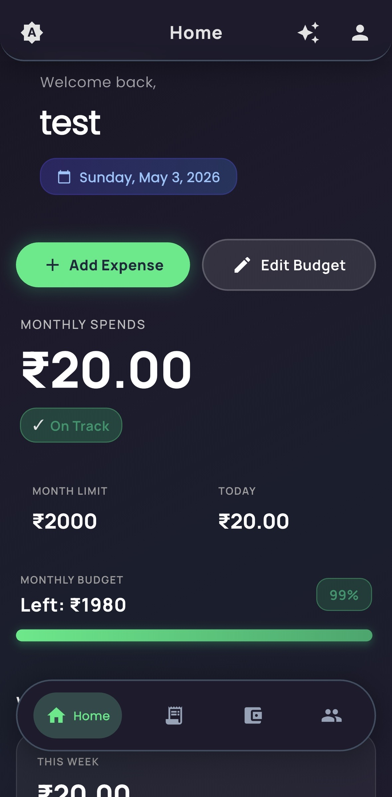
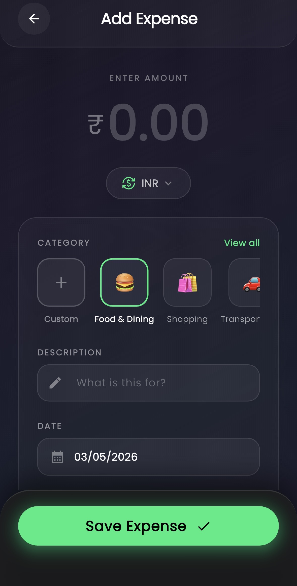
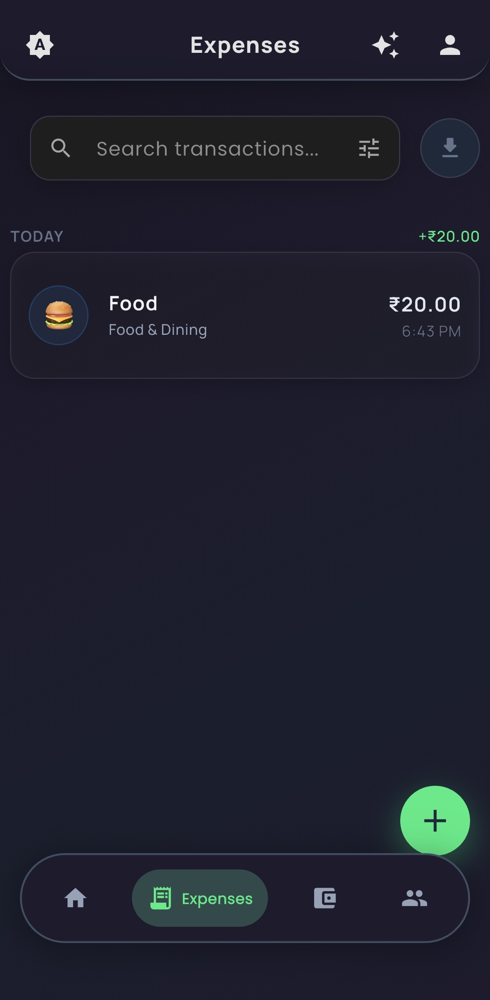
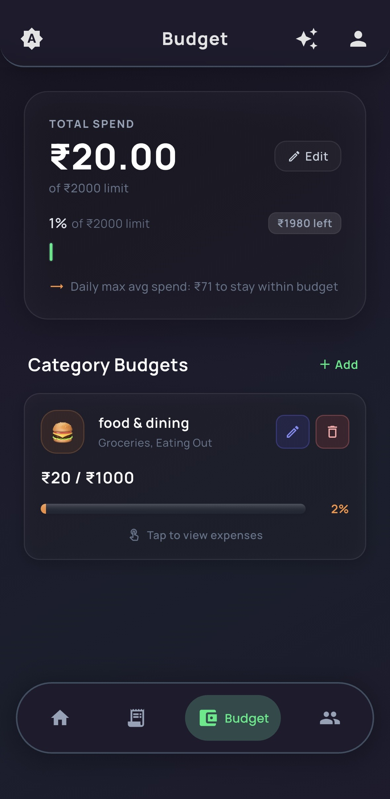
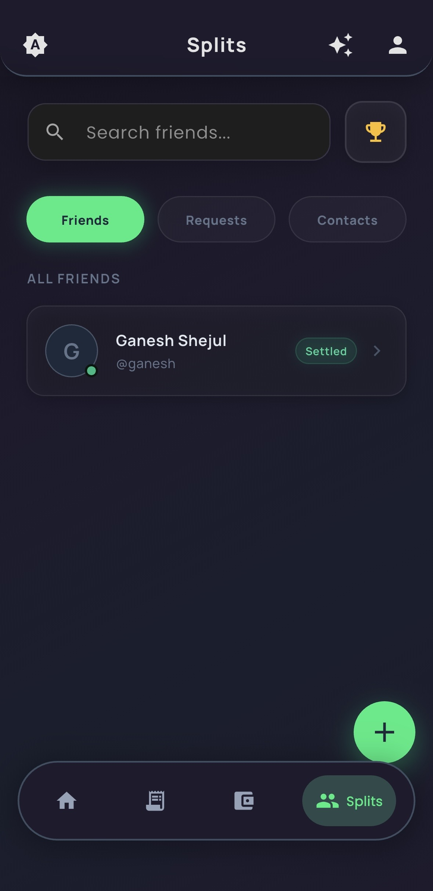
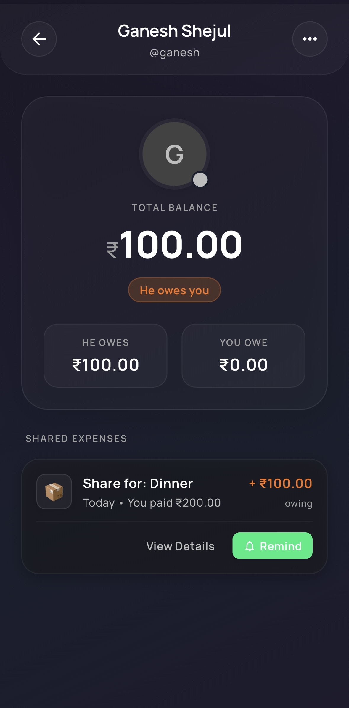
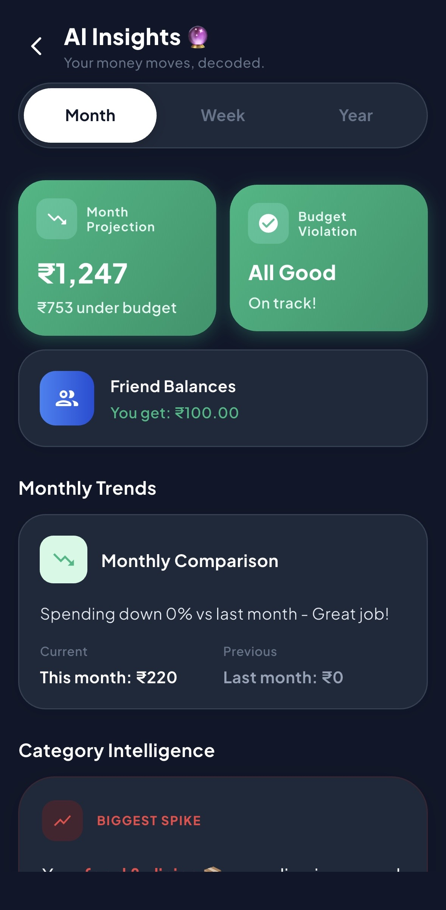

# Trackate

**Smart expense tracking and bill splitting — completely free.**

---

## What is Trackate?

Most expense apps demand constant manual entry — it gets ignored within a week. Trackate fixes this with **automatic expense detection**, reading payment notifications in real time so users never have to log manually.

Built for students and young users who want Splitwise-level bill splitting without the paywall. Every feature is free.

---

## Demo

<!-- Convert your .mp4 to GIF at ezgif.com and drop it in assets/ -->

[*Click to watch demo*](https://youtu.be/azwJVYIfk9g)

---

## Screenshots

  
  
  
  
  
  
  

---

## The problem it solves

| Problem | How Trackate solves it |
|---|---|
| Manual entry is tedious and gets abandoned | Auto-detects expenses from payment notifications |
| Splitwise locks features behind paywall | Full bill splitting, completely free |
| Hard to track shared group expenses | Real-time multi-party debt balancing |
| No visibility into spending patterns | Per-category budgets and live insights |
| App unusable without internet | Offline state via SharedPreferences, syncs on reconnect |

---

## Key features

- **Automatic expense detection** — reads Android payment notifications, no manual entry needed
- **Real-time spending insights** — live dashboard with per-category breakdowns and budget tracking
- **Bill splitting** — split expenses across multiple people, track who owes what, settle balances
- **Group expense management** — shared groups with real-time sync across all members
- **Offline support** — local state via SharedPreferences, syncs to Firebase on reconnect
- **Push notifications** — Firebase Cloud Messaging for payment reminders and group activity
- **Cross-platform ready** — Flutter codebase targeting Android now, iOS in v2

---

## Architecture

**Pattern:** MVVM with Provider for state management
**Key challenge:** Keeping personal expenses, category budgets, and multi-party debt balances consistent across four interconnected Firestore streams — with atomic batch writes ensuring no partial state when any one piece changes.

---

## Tech stack

| Layer | Technology |
|---|---|
| Framework | Flutter (Dart) |
| Architecture | MVVM + Provider |
| Auth | Firebase Authentication |
| Database | Cloud Firestore |
| Notifications | Firebase Cloud Messaging |
| Auto-detection | Android Notification Listener Service |
| Native bridge | Flutter Method Channels |
| Local storage | SharedPreferences |

---

## Engineering decisions worth noting

**Why Flutter?**
Single codebase targeting Android and IOS — without sacrificing UI quality. Flutter's widget system made it straightforward to build the custom dashboard and budget visualisations without reaching for third-party UI libraries.

**Why Notification Listener over manual entry?**
The biggest reason expense apps fail is friction. If users have to open the app and type every time they spend, they stop after a week. Reading from Android notifications removes the friction entirely — the expense is logged before the user even puts their phone down. This required bridging into native Android via Flutter Method Channels, which was the most technically involved part of the build.

**Why atomic Firestore batch writes?**
With four interconnected data streams — personal expenses, category budgets, group balances, and the debt ledger — a failed partial write would leave the database in an inconsistent state. A user could show as owing money they'd already settled, or a budget could show overspent before the expense was confirmed. Batch writes treat all four updates as a single transaction: either all succeed or none do.

---

## Roadmap

- [x] Automatic expense detection via Notification Listener Service
- [x] Bill splitting and group expenses
- [x] Real-time budget and spending insights
- [x] Firebase sync with offline support
- [x] Push notifications via FCM

---

## About the developer

Built and maintained solo by **Prathmesh Dawkar** 

> This is a showcase repository. Source code is private as this is a live commercial app.
# Trackate
